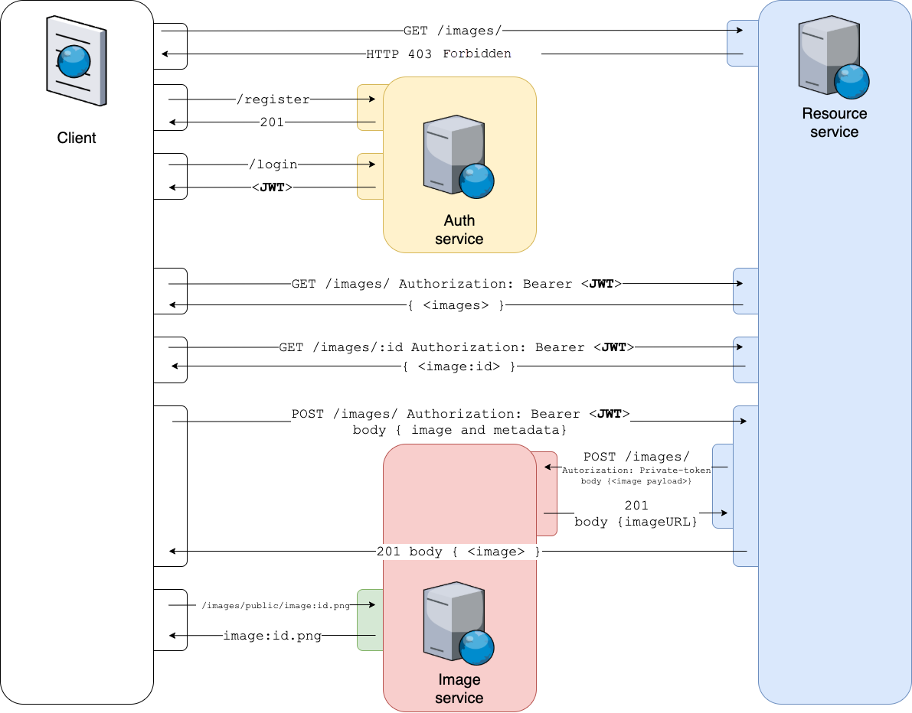

# Assignment B3 - Picture It

In this assignment, you will create a system consisting of three microservices: the Auth service, the Resource service, and the Image service. The Auth service will handle user authentication and provide JWTs to be used as bearer tokens for accessing the Resource service. The Resource service will handle images (called "resources") in a restful manner, storing image metadata and requesting the Image service to store the actual images. The Image service is already deployed and responsible for storing all images used by the application.

The system will have a single entry point from the consumer's perspective but will consist of multiple back-end services. You can use Postman or Curl to test the endpoints. No client application needs to be developed.

Here is an overview of the system architecture:

_The image service is already deployed._

Here is a flowchart illustrating the process for handling image requests:

0. The client tries to contact the Resource service but gets a 403 response.
1. The client registers an account and logs in to the system, receiving a JWT upon successful login.
2. Using the JWT as a Bearer token, the client can add, update, and delete resources in the system.
3. When the client makes a create, update, or delete request, the Resource service will request the Image service to add, delete, or update the corresponding image. The Resource service stores the resource metadata and responds to the client with the created document.
4. The client can request the image from the URL provided by the Resource service.

## Auth service

The Auth service is responsible for authenticating users and handing out JWTs upon login. The JWTs handed out by the Auth service should be trusted and validated by the Resource service to use account information stored in the JWT without contacting the Auth service.

For more information about the Auth service, see [Auth Service](../../../../auth-service) and issue #10.

## Resource service

The Resource service is responsible for handling the resources in the overall application, including image URLs, descriptions, and titles. However, the actual images will be stored by the Image service, not the Resource service.

For more information about the Resource service, see [Resource Service](../../../../resource-service) and issue #11.

## Image service (existing)

The Image service is already deployed and responsible for storing all images used by the application. It can be accessed at <https://courselab.lnu.se/picture-it/images/api/v1/>. Its documentation, available at <https://courselab.lnu.se/picture-it/images/api/v1/docs/>, provides more information about how to communicate with the service. Some important points to note:

- Image data must be sent as a Base64 encoded string.
- The service communicates using an Access token, which you can find in your "Secrets" project.
- The service has a public interface for serving images, and only the image URL needs to be stored in the Resource service.
- The payload size for requests to the server must not exceed 500kb. This means that only small images can be handled.

## This Project (Picture It)

In this project, you will find the [`assignment-routes.json`](./assignment-routes.json) file, which needs to be completed with references to the endpoints of the application. You will need to edit two different entries: your server address (in two separate places) and your student username (in two separate locations).

No code needs to be written to this repository, but you can use it to save test data and files for other necessary tools. When you complete the assignment, make a merge request to submit your work on this project. Do not make merge requests on any other project!

## Requirements

Make sure to read [all requirements of the application](../../issues/), including issues #1, #2, #3, #4, #5, #6, #7, #8, #9, #10, and #11. Pay extra attention to the labels indicating whether a requirement is required (~"req::required") or optional (~"req::optional").

You are required to close any issues and tasks ([ ]) that you implement. If you add any functionality, you must also create and close these issues.